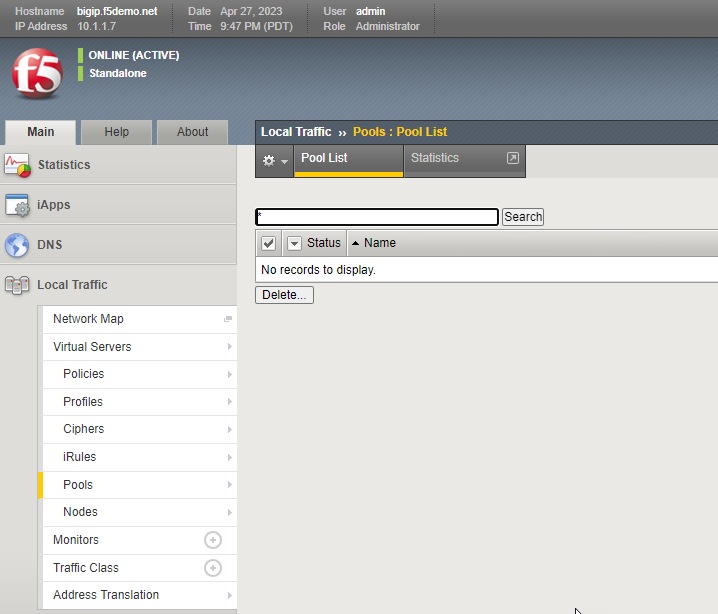
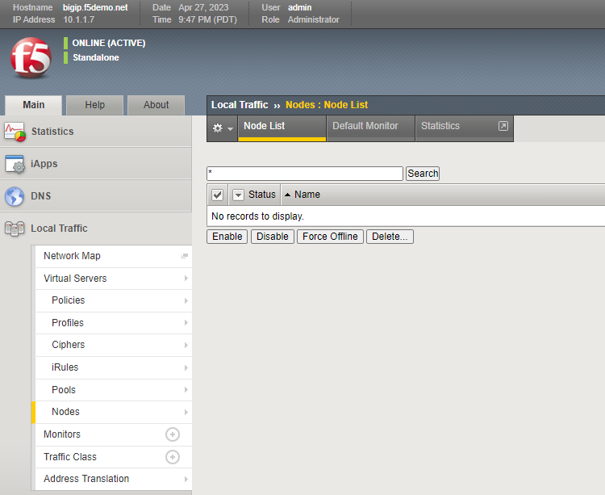

Exercise 2.1: Using a combination of modules to delete configuration on the BIG-IP
==================================================================================

Objective
*********

Demonstrate use of the different modules to delete the configuration (Nodes/Pool/Virtual Server) on the BIG-IP. 

Guide
*****

Step 1:
-------

  Examine the ``bigip-delete-configuration.yml`` in the VSCode editor.
  Expand in the Explorer (f5-bd-ansible-labs --> 101-F5-Basics --> 2.1-delete-configuration):

    .. figure:: ../images/bigip-delete-configuration.png
        :alt: 

        Examine the Code

  -  The variable ``irules`` is a list (array) defined with two irules => ‘irule1’ and irule2’
  -  The ``bigip_virtual_server:`` is the module for adding/modifying/deleting virtual servers on the BIG-IP.
  -  The ``bigip_pool:`` is the module for adding/modifying/deleting pools on the BIG-IP.
  -  The ``bigip_node:`` is the module for adding/modifying/deleting nodes on the BIG-IP.
  -  The ``bigip_irule:`` is the module for adding/modifying/deleting irules on the BIG-IP.
  -  The ``state:`` defines wether a object is created, modified or deleted.  In this usecase objects will be deleted.
  -  The ``set_fact:`` module is used to create variables used within the playbook.
  -  The ``provider:`` parameter is a group of connection details for the BIG-IP.

    *  The ``server: "{{ ansible_host }}"`` parameter tells the module to connect to the F5 BIG-IP IP address, which is stored as a variable ``ansible_host`` in inventory
    *  The ``user: "{{ ansible_user }}"`` parameter tells the module the username to login to the F5 BIG-IP device with
    *  The ``password: "{{ ansible_password }}"`` parameter tells the module the password to login to the F5 BIG-IP device with
    *  The ``server_port: "{{ server_port }}`` parameter tells the module the port to connect to the F5 BIG-IP device with
    *  The ``validate_certs: false`` parameter tells the module to not validate SSL certificates. This is just used for demonstration purposes since this is a lab.

Step 2:
-------

  Change directories to the exercise 2.1 folder to examine and execute the code in the Terminal

  .. code::

    cd ~/f5-bd-ansible-labs/101-F5-Basics/2.1-delete-configuration

Step 3:
-------

  Run the playbook - Go back to the Terminal on VS Code server on the control host and execute the following:

  .. code::

    ansible-navigator run bigip-delete-configuration.yml --mode stdout

  **Playbook Output**

  .. code:: yaml

    [rhel-user@ede7a345-c0f1-47f9-a73b-74fded8ec113 2.1-delete-configuration]$ ansible-navigator run bigip-delete-configuration.yml --mode stdout

    PLAY [BIG-IP TEARDOWN] *********************************************************

    TASK [Setup provider] **********************************************************
    ok: [f5]

    TASK [DELETE VIRTUAL SERVER] ***************************************************
    changed: [f5]

    TASK [DELETE POOL] *************************************************************
    changed: [f5]

    TASK [DELETE NODES] ************************************************************
    changed: [f5] => (item=node1)
    changed: [f5] => (item=node2)

    TASK [Delete iRules] ***********************************************************
    changed: [f5] => (item=irule1)
    changed: [f5] => (item=irule2)

    PLAY RECAP *********************************************************************
    f5                         : ok=5    changed=4    unreachable=0    failed=0    skipped=0    rescued=0    ignored=0  

Solution
********

The finished Ansible Playbook is provided here. Click here `bigip-delete-configuration.yml <https://github.com/network-automation/linklight/blob/master/exercises/ansible_f5/2.1-delete-configuration/bigip-delete-configuration.yml>`__.

Verifying the Solution
----------------------

    - Login to the F5 with your web browser to see what was configured. Grab the IP information for the F5 load balancer from the lab_inventory/hosts file, and type it in like so: 

        * **AWS Provisioner** - https://X.X.X.X:8443/
        * **F5 UDF** - https://X.X.X.X:443/

    - Login information for the BIG-IP:

        * username: admin 
        * password: **found in the inventory hosts file**

    - Navigate the menu on the left and view that the configuration has been deleted 
    
        * Local Traffic Manager -> Virtual Servers 
        * Local Traffic Manager -> Pools
        * Local Traffic Manager -> Nodes
        * Local Traffic Manager -> iRules

        |f5deleted1| 

        |f5deleted2|

        |f5deleted3|
        
        |f5deleted4|
        
You have finished this exercise. 

.. |f5deleted1| image:: ../images/deleted1.png

.. |f5deleted4| image:: ../images/deleted4.png
