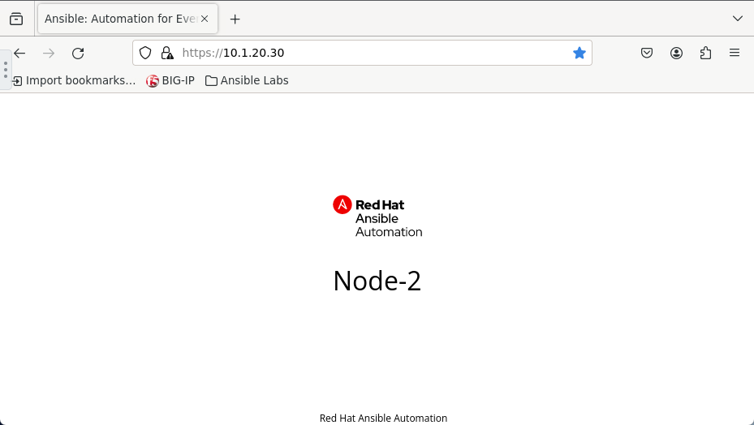
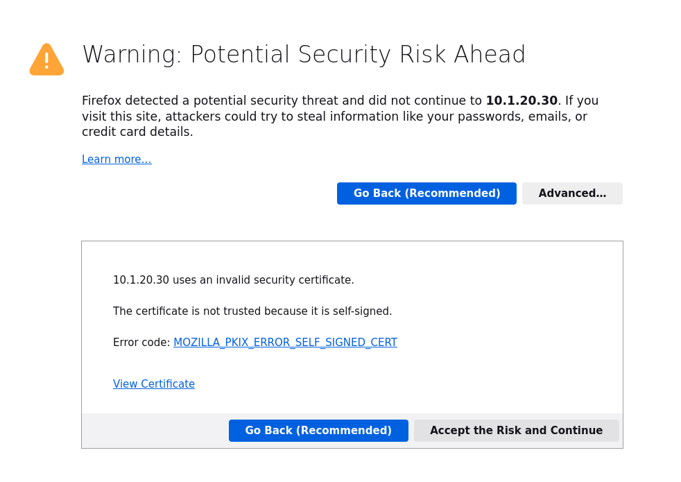
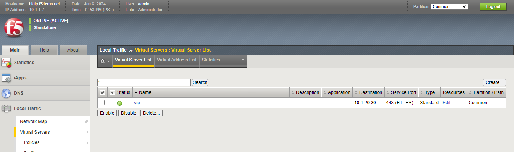

Exercise 4.1: Creating an Automation Controller Job Template
============================================================

Objective
*********

Demonstrate a BIG-IP Virtual Server configuration job template for Red Hat Ansible Automation Controller. This job template will create a virtual server, a pool, and add two web servers to the pool.

To run an Ansible Playbook in Ansible Automation Conrtoller, we need to create a **Job Template**. A **Job Template** requires:

   -  A **Credential** to login to devices.
   -  An **Inventory** to run the job against
   -  A **Project** which contains Ansible Playbooks

Guide
*****

Step 1: Create a Project
------------------------

   1. In the Ansible web UI, click on the ``Projects`` link under the ``RESOURCES`` section using the left navigation bar.

   2. Click on the |templates link| button to create a new project

   3. Fill out the project parameters as follows, and click ``Save``

      +-----------------------------------+--------------------------------------------------------------------+
      | Parameter                         | Value                                                              |
      +===================================+====================================================================+
      | NAME                              | Workshop Project                                                   |
      +-----------------------------------+--------------------------------------------------------------------+
      | ORGANIZATION                      | Default                                                            |
      +-----------------------------------+--------------------------------------------------------------------+
      | Default Execution Environment     | f5 workshop execution environment                                  |
      +-----------------------------------+--------------------------------------------------------------------+
      | SCM TYPE                          | Git                                                                |
      +-----------------------------------+--------------------------------------------------------------------+
      | SCM URL                           | https://github.com/f5devcentral/ansible-tower-workshop-examples.git|
      +-----------------------------------+--------------------------------------------------------------------+

   .. note:: 
      
      There may be additional projects setup in your environment.  Each project represents a repository of Ansible Playbooks. It is completly normal to have multiple projects.

      .. figure:: ../images/41-images/workshop_project.png
         :alt: workshop_project link

   All the playbooks are availabe at https://github.com/f5devcentral/ansible-tower-workshop-examples, and you may take a look at what’s behind each playbook.

               msg: "The VIP (Virtual IP) is https://{{ansible_host}}"

Step 2: Create BIGIP Credentials
--------------------------------

Before we can create a job we must create the credentials to authenticate to BIGIP.

   1. Open the web UI and click on the ``Credentials`` link under the ``RESOURCES`` section using the left navigation bar.

         .. figure:: ../images/41-images/credentials.png
            :alt: credentials link

   2. Click on the |templates link| button to create a new credentials template.

   3. Fill out the fields with the following credentials template parameters as follows:

         =============== =======
         Parameter       Value
         =============== =======
         NAME            BIGIP
         CREDENTIAL TYPE Network
         USERNAME        admin
         PASSWORD        
         \               
         =============== =======

      .. note:: 
         
         The password can be **found in the inventory hosts file**

   4. Click SAVE

Step 3: Create a Job Template
-----------------------------

   1. Open the web UI and click on the ``Templates`` link under the ``RESOURCES`` section using the left navigation bar.

         .. figure:: ../images/41-images/templates.png
            :alt: templates link

   2. Click on the |templates link| button to create a new job template

         Make sure to select **``Job Template``** and not **``Workflow Template``**

   3. Fill out the job template parameters as follows:

         =========== ==================
         Parameter   Value
         =========== ==================
         NAME        create_vs
         JOB TYPE    Run
         INVENTORY   Workshop Inventory
         PROJECT     Workshop Project
         PLAYBOOK    create_vs.yml
         CREDENTIALS BIGIP
         \           
         =========== ==================

      From the **CREDENTIAL TYPE** select ``Network``, then select ``BIGIP``:

         .. figure:: ../images/41-images/network.png
            :alt: network credential

      Here is a screenshot of the job template with parameters filled out:

         .. figure:: ../images/41-images/create_vs.png
            :alt: create_vs job template

   4. Scroll down and click the green ``SAVE`` button.

Step 4: Launch the Job Template
-------------------------------

   1. Navigate back to the ``Templates`` window, where all Job Templates are listed.

   2. Launch the ``create_vs`` Job Template by clicking the Launch Button.

         .. figure:: ../images/rocket.png
            :alt: rocket button

      When the launch button is clicked this will launch the job. The job will open in a new window called the **Job Details View**. More info about `Controller Jobs <https://docs.ansible.com/automation-controller/latest/html/userguide/jobs.html>`__ can be found in the documentation.

Step 5: Examine the Job Details View
------------------------------------

   1. What you will see is the **Standard Out pane**.

      .. figure:: ../images/41-images/job_create_vs.png
         :alt: job details view

   2. Examine the **Standard Out pane**

      The **Standard Out pane** will display the output from the Ansible Playbook. Every task output will match exactly what would be seen on the command line.

   3. Examine the **Details tab**

      The **Details tab** will provide information such as the timestamp for when the job started and finished, the job type (Check or Run), the user that launched the job, which Project and Ansible Playbook were used and more.

      If the Job has not finished yet, the **Details tab** will have a cancel button |cancel button| that can be used to stop the Job.

   4. Click on a task in the **Standard Out pane** to open up structured output from that particular task.

         Click on any line where there is a **changed** or **ok**

         .. figure:: ../images/41-images/task_details.png
            :alt: task details window

Step 6: Examine the Jobs window
-------------------------------

Any **Job Template** that has been run or is currently running will show up under the **VIEWS –> Jobs** window.

   1. Click the Jobs button the left menu.

         .. figure:: ../images/41-images/jobs.png
            :alt: jobs button

      The Jobs link displays a list of jobs and their status–shown as completed successfully or failed, or as an active (running) job. Actions you can take from this screen include viewing the details and standard output of a particular job, relaunch jobs, or remove jobs.

   2. Click on the **``create_vs``** Job

         .. figure:: ../images/41-images/jobslink.png
            :alt: jobs link

      The **``create_vs``** job was the most recent (unless you have been launching more jobs). Click on this job to return to the **Job Details View**. Ansible Automation Controller will save the history of every job launched.

Solution
********

The finished Ansible Playbook is provided here. Click here: `create_vs.yml https://github.com/f5devcentral/ansible-tower-workshop-examples/blob/master/create_vs.yml>`__.

Verifying the Solution
----------------------

   - Login to the F5 with your web browser to see what was configured. Grab the IP information for the F5 load balancer from the lab_inventory/hosts file, and type it in like so: 

      * https://X.X.X.X:443/

   - Login information for the BIG-IP:

      * username: admin 
      * password: **found in the inventory hosts file**

   - The load balancer virtual server can be found by navigating the menu on the left. Click on **Local Traffic**. then click on **Virtual Server**. See the screenshot below: |f5 vip image|

Verifying the web servers
-------------------------

   - Each RHEL web server actually already has a webserver running. Exercise 1.1 through 1.5 have successfully setup the load balancer for the pool of web servers.  To view the results of the Web services:

     * In the UDF Console goto the ``External Client`` and select ``Access`` and then select ``FireFox``
     * In the Bookmarks bar you can select the ``Ansible Labs`` Folder and goto ``101 - Labs`` and Select ``HTTPS`` 
     * OR within the browser you can browse to https://10.1.20.30/
     * You will need to bypass the certificate warning (within Firefox Warning --> Advanced --> Accept the Risk and Continue)

     |certificate|

   - Each time you refresh the host will change between **node1** and **node2**. Here is animation of the host field changing: 
   
     |node1| |node2|

You have finished this exercise.

Takeaways
*********

You have successfully demonstrated 

   - Creating a Job Template to deploy a Virtual Server 
   - Launching a Job Template from the Ansible Automation Controller UI 
   - Verifying the Virtual Server is correctly created 
   - Veryfying the web server is up and running

Complete
********

You have completed lab exercise 4.1

`Click here to return to the Ansible Network Automation Workshop <../README.md>`__

.. |templates link| image:: ../images/41-images/add.png
.. |cancel button| image:: ../images/41-images/cancel.png
.. |node1| image:: ../images/41-images/node1.png

